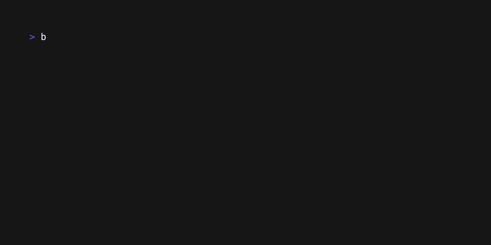

# Blastoise


A straightforward HTTP/1.1 benchmarking tool developed in Go, inspired by autocannon. I created this tool to experiment with Go as a programming language and to explore the charm cli and tui tools.

## Install

```
curl -fsSL https://raw.githubusercontent.com/ViktorAtterlonn/blastoise/main/install.sh | sh -
```

## Usage

```bash
Usage:
  blastoise [flags] url

Flags:
  -b, --body string              Set the HTTP body
  -d, --duration int             Set the duration in seconds (default 10)
  -H, --headers stringToString   Set the HTTP headers (default [])
  -h, --help                     help for blastoise
  -m, --method string            Set the HTTP method (default "GET")
  -r, --rps int                  Set the number of requests per second (default 1)
```

## Demo

